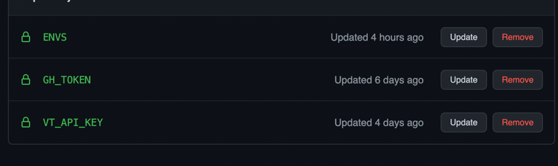

# Docker Py ReVanced

This little utility will help you in building all revanced apps.

## Build

You can use any of the following methods to build

- With Docker
  1.  Install Docker
  2.  Run script with
  ```shell
  docker-compose up
  ```
- Without Docker
  1.  Install Java17 (zulu preferred)
  2.  Install Python
  3.  Create virtual environment
      ```python
      python3 -m venv venv
      ```
  4.  Activate virtual environment
      ```python
      source venv/bin/activate
      ```
  5.  Install Dependencies with
      ```python
      pip install -r requirements.txt
      ```
  6.  Run the script with
      ```python
       python main.py
      ```
- In GitHub

  1.  Fork the project. Add following secrets to the repo

      1. _GH_TOKEN_ (**required**) - GitHub token so that it can upload to GitHub
         after building.
      2. _VT_API_KEY_ (required , only if you want Virus total scan) - So that it can send
         apks for VirusTotal Scan.
      3. _ENVS_ (optional) - If you want cook specific apps/versions
         ```dotenv
         PATCH_APPS=youtube,twitter,reddit
         YOUTUBE_VERSION=latest
         YOUTUBE_MUSIC_VERSION=latest
         TWITTER_VERSION=latest
         REDDIT_VERSION=latest
         TIKTOK_VERSION=latest
         WARNWETTER_VERSION=latest
         ```
         Should look something like this in GitHub
      4. <details>
          <summary>Samples</summary>

         - **`Secrets`** should like this

         

         - **`ENVS`** secret can look something like this

         ```python
         PATCH_APPS=youtube_music,twitter
         EXCLUDE_PATCH_YOUTUBE=custom-branding
         EXCLUDE_PATCH_YOUTUBE_MUSIC=yt-music-is-shit
         YOUTUBE_VERSION=67.68.69
         YOUTUBE_MUSIC_VERSION=latest
         TWITTER_VERSION=0.2.2
         REDDIT_VERSION=latest
         TIKTOK_VERSION=latest
         WARNWETTER_VERSION=latest
         ```

         </details>

  2.  Go to actions tab. Select `Build Revanced APK`.Click on `Run Workflow`.

## Note

By default, script build the version as recommended by revanced team.

1. If you want to a specific version . Add the version in `environment` like
   ```dotenv
   YOUTUBE_VERSION=17.31.36
   YOUTUBE_MUSIC_VERSION=X.X.X
   TWITTER_VERSION==X.X.X
   REDDIT_VERSION==X.X.X
   TIKTOK_VERSION=X.X.X
   WARNWETTER_VERSION=X.X.X
   ```
2. If you want to a `latest` version, whatever latest is available(including beta) .
   Add `latest` in `environment` file like
   ```dotenv
   YOUTUBE_VERSION=latest
   YOUTUBE_MUSIC_VERSION=latest
   TWITTER_VERSION==latest
   REDDIT_VERSION==latest
   TIKTOK_VERSION=latest
   WARNWETTER_VERSION=latest
   ```
3. By default, it will build all build app supported by revanced team. If you don't
   want to waste time and build only few apps. Add following(the apps you want to
   build) `environment`.
   ```dotenv
   PATCH_APPS=youtube,twitter,reddit
   ```
4. If you don't want to use default keystore. You can provide your own by placing it
   inside `apks` folder. And adding the name of file in `environment`
   ```dotenv
    KEYSTORE_FILE_NAME=revanced.keystore
   ```
5. If you want to exclude any patch. Set comma seperated environment variable like
   ```dotenv
    EXCLUDE_PATCH_YOUTUBE=custom-branding,hide-get-premium
    EXCLUDE_PATCH_YOUTUBE_MUSIC=yt-music-is-shit
   ```

Thanks to [@aliharslan0](https://github.com/aliharslan0/pyrevanced) for his work.
